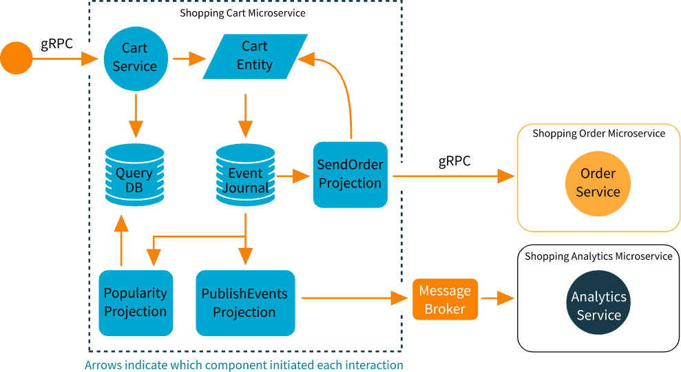

# Akka Microservice Tutorial

## Description

This project is based on the
tutorial [Implementing Microservices with Akka](https://developer.lightbend.com/docs/akka-platform-guide/microservices-tutorial/index.html)
which main goal is to develop microservices by leveraging Akka platform, including solution for grcp communication,
sharding, event sourcing and CQRS. The toolkits used in this project are:

- Akka GRPC for grpc-based server
- Akka Actor for entities and concurrent computation
- Akka Cluster for distributed computation and sharding
- Akka Persistence for persisting states and events (Event Sourcing)
- Akka Projection for read-side of the CQRS
- Akka Stream Kafka for inter-service communication: Shopping Cart Service -> Shopping Order Service
- ScalikeJdbc for Jdbc connections to Postgresql

Figure below present the architecture overview.
<center>



</center>

The services `Card Service` and `Order Service` are implemented using Akka gRPC for communication.
`Cart Entity` is modelled as an actor with a list of supported commands and events. Each generated event is persisted
into an event journal (Postgresql) using Akka Actor (`EventSourcedBehavior`), Akka Persistence and Akka Serialization.
The current state of `ShoppingCart` entity is then available in memory or reconstruct from the event journal.

To perform another type of query that does not require the `ShoppingCart` entity, projects are used as the read-side of
the CQRS. Akka Projection with Jdbc support is used to create a table with the item popularity. This project uses the _
exactly once_ semantics.

Every generated event is also projected to the message broker (Kafka) as async communication to Analytics Service. The
latter then filter only desired events to perform any computation. This project uses the _at least once_ semantics.

Another project is related to order checkout. Once the event `CheckedOut` is generated and persisted, it is sent to
Order Service using gRPC communication. This project uses the _at least once_ semantics.

## Running the project

1. Start the shopping cart service:

    ```shell
    sbt -Dconfig.resource=local1.conf shopping-cart-service/run
    ```

2. Start the shopping analytics service:
    ```shell
    sbt -Dconfig.resource=local1.conf shopping-analytics-service/run
    ```

3. Start the shopping order service:
    ```shell
    sbt -Dconfig.resource=local1.conf shopping-order-service/run
    ```

## Running tests

```bash
sbt test
```

## Case Study

1. Start the infrastructure, Postgresql, Kafka and Zookeeper:
   ```shell
   docker compose up
   ```

2. Create the database model:
   ```shell
   docker exec -i  akka-microservice-tutorial_postgres-db_1 psql -U shopping-cart -t < ddl-scripts/*.sql
   ```

3. Setup some alias:
   ```shell
   SERVER=127.0.0.1:8101
   ```

4. Requesting the Cart Server with `grpcurl`:

   4.1. Add new item `t-shirt` to `cart 1`:
   ```shell
   grpcurl \
   -d '{"cartId":"cart1", "itemId":"t-shirt", "quantity":1}' \
   -plaintext \
   ${SERVER} \
   shoppingcart.ShoppingCartService.AddItem
   ```

   4.2. Add `trousers` to `cart 1`:
   ```shell
   grpcurl \
   -d '{"cartId":"cart1", "itemId":"trousers", "quantity": 2}' \
   -plaintext \
   ${SERVER} \
   shoppingcart.ShoppingCartService.AddItem
   ```

   4.3. Get the current cart:
   ```shell
   grpcurl \
   -d '{"cartId": "cart1"}' \
   -plaintext \
   ${SERVER} \
   shoppingcart.ShoppingCartService.Get
   ```

   4.4. Add a `hat`:
   ```shell
   grpcurl \
   -d '{"cartId":"cart1", "itemId":"hat", "quantity": 1}' \
   -plaintext \
   ${SERVER} \
   shoppingcart.ShoppingCartService.AddItem
   ```

   4.5. Remove the `hat`:
   ```shell
   grpcurl \
   -d '{"cartId":"cart1", "itemId":"hat"}' \
   -plaintext \
   ${SERVER} \
   shoppingcart.ShoppingCartService.RemoveItem
   ```

   4.6. Adjust the quantity of `t-shirts`:
   ```shell
   grpcurl \
   -d '{"cartId":"cart1", "itemId":"t-shirt", "quantity": 4}' \
   -plaintext \
   ${SERVER} \
   shoppingcart.ShoppingCartService.AdjustItemQuantity
   ```

   4.7. Get `t-shirt` popularity:
   ```bash
   grpcurl \
   -d '{"itemId":"t-shirt"}' \
   -plaintext \
   ${SERVER} \
   shoppingcart.ShoppingCartService.GetItemPopularity
   ```

   4.8. Checkout `cart 1`:
   ```shell
   grpcurl \
   -d '{"cartId":"cart1"}' \
   -plaintext \
   ${SERVER} \
   shoppingcart.ShoppingCartService.Checkout
   ```